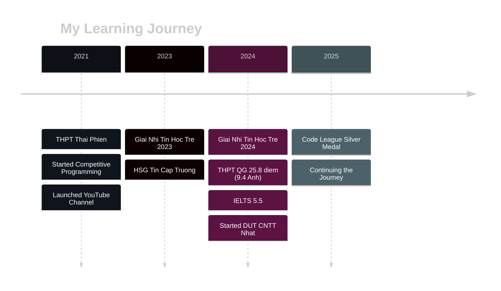

<div align="center">
  
  <!-- Animated Header -->
  
  
  <!-- Typing Animation -->
  <a href="https://git.io/typing-svg">
    
  </a>
  
  <br/>
  
  <!-- Profile Views Badge -->
  
  
</div>

<br/>

<!-- About Me Section -->
<div align="center">
  
##  About Me

</div>

```typescript
const developer = {
    name: "Ngô Hữu Chí Quang",
    title: "IT Student & Software Developer",
    location: "Đà Nẵng, Việt Nam 🇻🇳",
    education: "CNTT Ngôn Ngữ Nhật - ĐH Bách Khoa Đà Nẵng",
    
    languages: {
        vietnamese: "Native 🇻🇳",
        english: "IELTS 5.5 📖",
        japanese: "Learning 🗾"
    },
    
    passions: [
        "💻 Competitive Programming",
        "🌐 Web Development", 
        "🎬 Content Creation (51K+ YouTube)",
        "📚 Continuous Learning"
    ],
    
    currentFocus: "Building modern web apps with React & TypeScript",
    motto: "Mình là người dễ gần, vui vẻ, luôn sẵn sàng học hỏi! 😄"
};
```

<br/>

<!-- Achievements Section with Colorful Design -->
<div align="center">

## 🏆 Achievements & Highlights

<table>
  <tr>
    <td align="center" width="25%">
      
      <br/><b>🥈 Code League 2025</b>
      <br/>Silver Medal @ DUT
    </td>
    <td align="center" width="25%">
      
      <br/><b>🏅 Tin Học Trẻ</b>
      <br/>Giải Nhì 2023 & 2024
    </td>
    <td align="center" width="25%">
      
      <br/><b>📺 YouTube Creator</b>
      <br/>51K+ Subscribers
    </td>
    <td align="center" width="25%">
      
      <br/><b>🎓 THPT QG 2024</b>
      <br/>25.8 điểm (9.4 Anh)
    </td>
  </tr>
</table>

</div>

<br/>

<!-- Tech Stack Section with Better Spacing -->
<div align="center">

## 🛠️ Tech Stack

### 💻 Languages

<p>
  
  &nbsp;&nbsp;
  
  &nbsp;&nbsp;
  
  &nbsp;&nbsp;
  
</p>

### 🎨 Frontend & Frameworks

<p>
  
  &nbsp;&nbsp;
  
  &nbsp;&nbsp;
  
  &nbsp;&nbsp;
  
</p>

### 🔧 Tools & Technologies

<p>
  
  &nbsp;&nbsp;
  
  &nbsp;&nbsp;
  
  &nbsp;&nbsp;
  
</p>

</div>

<br/>

<!-- GitHub Stats Section with Better Layout -->
<div align="center">

## 📊 GitHub Statistics

<table>
  <tr>
    <td width="50%" align="center">
      
    </td>
    <td width="50%" align="center">
      
    </td>
  </tr>
</table>

<!-- GitHub Streak -->


</div>

<br/>

<!-- Featured Projects -->
<div align="center">

## 🚀 Featured Projects

<table>
  <tr>
    <td width="50%" align="center">
      <a href="https://github.com/QuangNew/SnapCapAI">
        
      </a>
    </td>
    <td width="50%" align="center">
      <a href="https://github.com/QuangNew/QuangNew">
        
      </a>
    </td>
  </tr>
</table>

</div>

<br/>

<!-- YouTube Section -->
<div align="center">

## 🎬 Content Creation

<table>
  <tr>
    <td align="center">
      
      <br/><br/>
      <b>📺 YouTube Channel</b>
      <br/><br/>
      
      <br/><br/>
      <b>Topics:</b> VTuber
      <br/>
      <b>Community:</b> 32K+ Group Members
      <br/>
      <b>Since:</b> 2021 - Present
    </td>
  </tr>
</table>

</div>

<br/>

<!-- Education Timeline -->
<div align="center">

## 🎓 Education & Journey

</div>



<br/>

<!-- Contribution Graph -->
<div align="center">

## � Contribution Activity


<br/>

<!-- GitHub Contribution Stats -->


<br/>

<table>
  <tr>
    <td width="50%" align="center">
      
    </td>
    <td width="50%" align="center">
      
    </td>
  </tr>
  <tr>
    <td width="50%" align="center">
      
    </td>
    <td width="50%" align="center">
      
    </td>
  </tr>
</table>

</div>

<br/>

<!-- Quote Section -->
<div align="center">

## 💭 Developer Quote of the Day


</div>

<br/>

<!-- Social Links -->
<div align="center">

## 🌐 Connect With Me

<p>
  <a href="https://www.facebook.com/wuangnew">
    
  </a>
  &nbsp;&nbsp;&nbsp;
  <a href="https://github.com/QuangNew">
    
  </a>
  &nbsp;&nbsp;&nbsp;
  <a href="mailto:nbxchiquang@gmail.com">
    
  </a>
  &nbsp;&nbsp;&nbsp;
  <a href="https://beacons.ai/quangnew">
    
  </a>
</p>

<br/>

### 💙 Show some love by starring ⭐ my repositories!

<br/>


</div>
