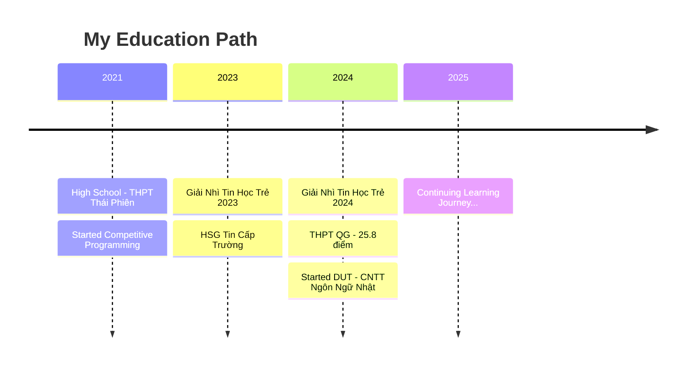

<div align="center">
  
</div>

<div align="center">
  
  [](https://git.io/typing-svg)
  
</div>

<br/>

## 👨‍💻 About Me

```typescript
const quangnew = {
    name: "Ngô Hữu Chí Quang",
    location: "Đà Nẵng, Việt Nam 🇻🇳",
    education: "CNTT Ngôn Ngữ Nhật - Đại học Bách Khoa Đà Nẵng",
    role: "IT Student & Developer",
    languages: {
        vietnamese: "Native",
        english: "IELTS 5.5",
        japanese: "Learning 🗾"
    },
    interests: ["Software Development", "Web Development", "Competitive Programming", "Content Creation"],
    currentFocus: "Building modern web applications with React & TypeScript",
    funFact: "Mình là một người dễ gần, vui vẻ, luôn sẵn sàng học hỏi! 😄"
};
```

<br/>

## 🏆 Achievements & Milestones

<div align="center">

| 🎯 Achievement | 📊 Details |
|:---|:---|
| 🏅 **Giải Nhì Tin Học Trẻ** | 2023 & 2024 |
| 📺 **YouTube Channel** | 51K+ Subscribers |
| 👥 **Community Leader** | 31K+ Group Members |
| 🎓 **THPT QG 2024** | 25.8 điểm khối A01 (9.4 Tiếng Anh) |
| 🏫 **High School** | HSG Tin Cấp Trường - THPT Thái Phiên |

</div>

<br/>

## 🛠️ Tech Stack & Skills

<div align="center">

### 💻 Programming Languages


### 🎨 Frontend Development


### ⚙️ Backend & Tools


</div>

<br/>

## 📊 GitHub Statistics

<div align="center">
  
  
</div>

<div align="center">
  
</div>

<div align="center">
  
</div>

<br/>

## 🚀 Featured Projects

<div align="center">

<a href="https://github.com/QuangNew/SnapCapAI">
  
</a>

<a href="https://github.com/QuangNew/QuangNew">
  
</a>

</div>

<br/>

## 🎬 Content Creation

<div align="center">

### 📺 YouTube Channel Management
- 🎯 **51K+ Subscribers** - Growing community of tech enthusiasts
- 👥 **31K+ Group Members** - Active community engagement
- 📅 **Since 2021** - Consistent content creation
- 🎥 Topics: Programming, Tech Reviews, Tutorials

</div>

<br/>

## 🎓 Education Journey



<br/>

## 📫 Connect With Me

<div align="center">

[](https://www.facebook.com/wuangnew)
[](https://github.com/QuangNew)
[](mailto:nbxchiquang@gmail.com)
[](https://beacons.ai/quangnew)

</div>

<br/>

## 💭 Random Dev Quote

<div align="center">


</div>

<br/>

## 🐍 Contribution Snake

<div align="center">


</div>

<br/>

## 📈 Profile Views

<div align="center">


</div>

---

<div align="center">
  
### 💙 Show some love by starring ⭐ some of my repositories!


</div>
